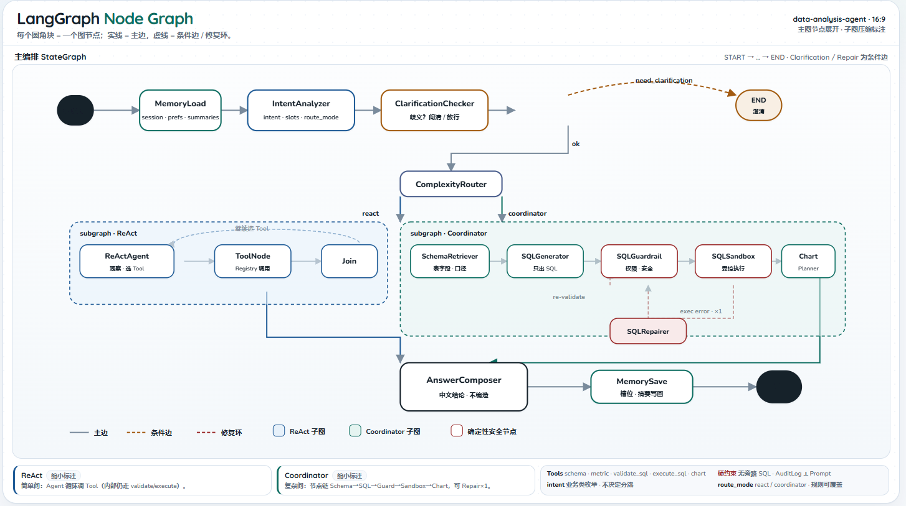

# data-analysis-agent

[](https://github.com/langchain-ai/langgraph)
[](https://github.com/langchain-ai/langchain)
[](https://www.python.org/)
[](https://fastapi.tiangolo.com/)
[](https://react.dev/)
[](./LICENSE)

面向电商经营分析的自然语言数据分析 Agent。

基于 [LangGraph](https://github.com/langchain-ai/langgraph) 做状态图编排，基于 [LangChain](https://github.com/langchain-ai/langchain) 提供 LLM / Tools / Memory 抽象。用户用自然语言提问，系统经意图识别（封闭枚举 `intent` + 薄词表 `slots` + 建议 `route_mode`）、澄清与分流后，走 ReAct 或 Coordinator，再完成 Schema Linking、SQL 生成、权限校验、沙箱执行、错误修复，并以 SSE 流式输出表格、图表与分析结论。

[](./docs/architecture-16x9.html)

> **状态说明**：规格以 [`docs/`](./docs/需求文档.md) 为准（尤其 [`03-Agent设计`](./docs/03-Agent设计.md)）。按 [`06-开发计划`](./docs/06-开发计划.md) 分 Phase 实现。  
> **Phase 1 已落地**：`backend/` / `frontend/` 脚手架、`init_db`、不鉴权的 `GET /api/schema`、JSON 日志骨架。登录 / chat / Agent 等仍为目标形态（Phase 2+）。  
> **Python**：强制使用 conda 环境 `python3.12`（见 [`AGENTS.md`](./AGENTS.md)），勿用系统 Python 或仓库内 `.venv`。

---

## 目录

- [为什么不是普通 Text-to-SQL](#为什么不是普通-text-to-sql)
- [架构](#架构)
- [技术栈](#技术栈)
- [功能一览](#功能一览)
- [本地启动](#本地启动)
- [角色与权限](#角色与权限)
- [SQL Guardrail 与沙箱](#sql-guardrail-与沙箱)
- [Trace / AuditLog](#trace--auditlog)
- [记忆](#记忆)
- [界面预览](#界面预览)
- [评测](#评测)
- [失败案例分析](#失败案例分析)
- [后续扩展](#后续扩展)
- [License](#license)

---

## 为什么不是普通 Text-to-SQL

| 普通 Demo | data-analysis-agent |
|-----------|-------------------|
| 一次 prompt 出 SQL | LangGraph 状态图：节点可观测、可修复 |
| 模型直连数据库 | Guardrail + 沙箱，角色差异化权限 |
| 同步黑盒结果 | SSE 流式展示节点 / Tool 轨迹 |
| 无账号体系 | JWT 登录；analyst / admin（邀请码） |
| 无治理 | Tool Registry + AuditLog（与 Prompt 分离） |

主链路：

```text
自然语言问题
  → Memory 读入（Session / 偏好 / 摘要；两模式共用）
  → IntentAnalyzer（intent 枚举 + slots 薄词表 + 建议 route_mode）
  → 澄清检查 / ComplexityRouter（规则可覆盖 route_mode）
  → ReAct 或 Coordinator（共用同一批 Tool / Guardrail）
  → Schema Linking（业务词 → 表字段）→ SQL 生成
  → 权限校验 → 沙箱执行 → 错误修复
  → 图表规划 → 分析结论
  → Memory 写回
```

分流（`intent` ≠ 路径；看 `route_mode`）：

- **简单（react）** → 单 Agent ReAct  
- **复杂（coordinator）** → Coordinator 子图（Schema / SQL / Chart·Insight 步骤）  
- IntentAnalyzer 建议 `route_mode`；ComplexityRouter 可用规则硬覆盖（`route_source=rule_override`）  
- Session / 偏好与摘要的读写在主图两端，**ReAct 与 Coordinator 共用**

---

## 架构

```text
                    ┌─────────────────────────────────────┐
                    │     /  营销登录·注册（JWT）            │
                    └─────────────────┬───────────────────┘
                                      │
                    ┌─────────────────▼───────────────────┐
                    │     /app 工作台（SSE Chat）            │
                    └─────────────────┬───────────────────┘
                                      │
┌─────────────────────────────────────▼─────────────────────────────────────┐
│                         FastAPI + LangGraph                                 │
│  Memory读 → IntentAnalyzer → ClarificationChecker → ComplexityRouter         │
│       ├─ ReAct（简单）                                                      │
│       └─ Coordinator 子图（复杂；复用同一批 Tool）                              │
│            Tools: query_schema / metric / validate_sql / execute_sql / chart │
│            Guardrail → Sandbox → Repair → Compose → Memory写               │
│            AuditLog (JSONL)  ⟂  agent_trace (SSE / UI)                     │
└─────────────────────────────────────┬─────────────────────────────────────┘
                                      │
                    ┌─────────────────▼───────────────────┐
                    │  SQLite：8 张业务表 + 应用表            │
                    │  (账号 / session / 偏好 / 摘要)         │
                    └─────────────────────────────────────┘
```

编排选型：**[LangGraph](https://github.com/langchain-ai/langgraph)**（状态图）+ **[LangChain](https://github.com/langchain-ai/langchain)**（LLM / Tools / Memory）。  
SQL 安全为确定性独立模块，不使用黑盒 SQL Agent。  

一页 Agent 架构图（16:9 浅色，不含前后端）：[`docs/architecture-16x9.html`](./docs/architecture-16x9.html) · 规格细节见 [`docs/03-Agent设计.md`](./docs/03-Agent设计.md)。

官方文档：[LangGraph Docs](https://docs.langchain.com/oss/python/langgraph/overview) · [LangChain Docs](https://docs.langchain.com/oss/python/langchain/overview)

---

## 技术栈

| 层 | 技术 |
|----|------|
| 前端 | React · Vite · TypeScript · TailwindCSS · Recharts |
| 后端 | Python · FastAPI · Pydantic · JWT · SSE |
| Agent | [LangGraph](https://github.com/langchain-ai/langgraph) · [LangChain](https://github.com/langchain-ai/langchain) |
| 数据 | SQLite（8 张业务表 + 应用表） |
| 模型 | OpenAI 兼容 API（`config.yaml` 配置） |

---

## 功能一览

- 自然语言经营分析（GMV、退款率、转化率、渠道 TopN 等）
- 注册 / 登录；`admin` 需邀请码
- SSE 流式 Trace（含 `route_decision`）、SQL、结果表、图表、结论
- analyst 只读 + 敏感字段拦截；admin 受控写（INSERT/UPDATE/DELETE）
- Session 多轮槽位 + 跨 Session「偏好 JSON + 最近摘要列表」（无向量）
- 评测集与指标脚本

---

## 本地启动

> Phase 1 可启动后端与前端脚手架。注册登录 / 工作台提问为 Phase 2+ 目标形态。

### 1. 配置

复制模板并填写（**不要提交 `config.yaml`**）：

```bash
cp config_template.yaml config.yaml
```

主要字段：

| 段 | 说明 |
|----|------|
| `llm.*` | OpenAI 兼容模型（`api_key` / `base_url` / `model`） |
| `backend.*` | 端口、`jwt_secret`、`admin_invite_code`、`database_path`、`cors_origins` |
| `frontend.*` | 开发端口、`api_base_url` |

### 2. 后端

使用 [`AGENTS.md`](./AGENTS.md) 指定的 conda `python3.12`：

```bash
cd backend
/home/user/miniconda3/envs/python3.12/bin/pip install -r requirements.txt
/home/user/miniconda3/envs/python3.12/bin/python -m app.db.init_db    # 业务表 + 应用表 + 模拟数据（会覆盖本地库）
/home/user/miniconda3/envs/python3.12/bin/uvicorn app.main:app --reload --host 0.0.0.0 --port 8000
```

端口与 CORS 以 `config.yaml` 的 `backend` 段为准。验收探针：`GET http://127.0.0.1:8000/api/schema`（Phase 1 **暂不鉴权**，仅返回 8 张业务表）。

### 3. 前端

```bash
cd frontend
npm install
npm run dev
```

Vite 会读取根目录 `config.yaml`（缺失时回退 `config_template.yaml`）中的 `frontend.port` / `api_base_url`。

浏览器打开前端地址（默认 `http://localhost:5173`）。Phase 1 为 Vite 默认页；Phase 2 起：

1. 在 `/` 注册：默认 `analyst`；选 `admin` 时填写邀请码  
2. 登录后进入 `/app` 工作台提问  

### 4. 示例问题（Phase 2+）

- 上个月 GMV 最高的 5 个渠道是什么？  
- 最近 30 天每天的订单量和 GMV 趋势如何？  
- 哪些商品品类的退款率最高？  

---

## 角色与权限

| | analyst | admin |
|--|---------|--------|
| 注册 | 直接注册 | 需 `ADMIN_INVITE_CODE` |
| SELECT | 经营数据 OK | 全部业务字段 |
| 敏感字段 | 拦截（`users.name/phone/email/id_card`） | 允许 |
| INSERT / UPDATE / DELETE | 禁止 | 允许（**仅业务表**） |
| DROP / ALTER / 多语句 / 系统表 / **全部应用表** | 禁止 | 禁止 |

应用表包括：`app_users`、`chat_sessions`、`session_turns`、`user_preferences`、`user_analysis_summaries`。  
角色来自服务端 JWT，**前端不可自行切换角色**。

---

## SQL Guardrail 与沙箱

**Guardrail（执行前）**

- 解析语句类型与涉及表字段  
- 按角色允许 / 拒绝；禁止访问全部应用表  
- 明细查询补 `LIMIT`；写操作限制影响行数  
- 不通过则阻断，不进沙箱  

**Sandbox（执行时）**

- analyst → 只读连接；admin → 可写连接  
- 超时、行数 / 影响行数上限  
- 错误脱敏，不回传堆栈  
- 写操作记入 AuditLog，Trace 标记高风险  

**约束**：可演示 / 默认可运行路径上的 SQL **必须**经 Guardrail；开发期临时直连不得进入演示分支。

---

## Trace / AuditLog

参照常见 AI 应用治理：**展示轨迹** 与 **审计日志** 分离，且默认不注入 Prompt。

| 类型 | 用途 |
|------|------|
| `agent_trace` + SSE | 前端可解释展示（`node_*` / `tool_*` / `route_decision`） |
| `AuditLog`（JSONL） | 排查、权限与写操作追溯 |

关联字段：`request_id` · `trace_id` · `session_id` · `user_id` · `user_role`  

Tool 路径固定 PreToolUse → 执行 → PostToolUse；日志脱敏（密码、JWT、邀请码、Key、敏感字段明文）。

---

## 记忆

| 层 | 内容 | 存储 |
|----|------|------|
| Session | 近 N 轮槽位（metrics / time_range / filters 等业务词） | 内存 + `chat_sessions` / `session_turns` |
| 用户长期（轻量） | **偏好 JSON** + **最近摘要列表** | `user_preferences` / `user_analysis_summaries` |

不做 embedding / 向量检索，不做复杂记忆产品。敏感字段不入长期记忆。

---

## 界面预览

实现后将截图放到 `assets/` 并在此引用：

| 页面 | 占位 |
|------|------|
| 营销登录 / 注册页 | `` |
| 工作台 | `` |
| Agent Trace / SSE | `` |

截图随前端完善后补齐。

---

## 评测

```text
backend/app/eval/questions.json    # ≥30 条（含多轮 turns）
backend/app/eval/run_eval.py
backend/app/eval/eval_result.json  # 输出
```

指标：

- `execution_success_rate`
- `repair_success_rate`
- `schema_hit_rate`
- `permission_block_success_rate`
- `average_latency_ms`
- （可选）`route_match_rate`

```bash
cd backend && python -m app.eval.run_eval
```

### 评测结果

| 指标 | 结果 |
|------|------|
| execution_success_rate | _待跑评测后填写_ |
| repair_success_rate | _待填写_ |
| schema_hit_rate | _待填写_ |
| permission_block_success_rate | _待填写_ |
| average_latency_ms | _待填写_ |

---

## 失败案例分析

实现与评测后在此补充典型失败与对策，例如：

| 场景 | 现象 | 处理 |
|------|------|------|
| 模糊指标 | 触发澄清，不盲生成 SQL | ClarificationChecker |
| 危险 SQL | Guardrail 阻断 | analyst 写操作 / DDL / 应用表 |
| 执行报错 | 最多 1 次 Repair，再过 Guardrail | SQLRepairer |
| 权限不足 | SSE `error` + AuditLog | 字段 / 角色策略 |

---

## 后续扩展

- MCP Tool Provider  
- 用户上传 OpenAPI Tool Manifest  
- 适配 CodeBuddy SDK  
- 接入真实企业数仓  
- 更严格的语义评测  

**不做**：真实支付 / 订单 / CRM 等外部业务系统接入；向量语义记忆；绕过 Guardrail 的第二套 SQL 路径。

---

## License

本项目采用 [MIT License](./LICENSE) 开源。
