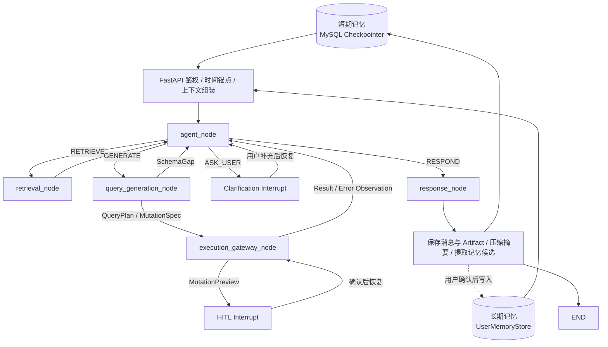

# 电商 Data Runtime Agent MVP 技术方案

> 项目定位：使用 Python、FastAPI、LangGraph 和 React 构建一个面向电商交易分析的 Runtime Agent。Agent 可以在运行时查看 Schema、查询数据、分析结果、处理多轮追问，并为管理员准备受控的数据修改；所有外部操作都被权限、AST、成本检查、HITL 和审计机制包裹。

本文描述的是目标设计，不代表这些能力已经实现。只有完成代码和固定评测后，才能把相关功能与指标写成项目事实。

## 1. 设计目标与项目边界

### 1.1 要解决的问题

系统应支持以下任务：

```text
Schema 查询
  “orders 表有哪些字段？”
  “支付时间字段是什么？”

数据读取与分析
  “昨天各品类 GMV 是多少？”
  “对比本月和上月各品类 GMV，找出下降最多的三个品类。”

多轮追问
  “只看华东。”
  “用刚才返回的第一个字段查重复值。”
  “再加上退款率。”

受控数据写入
  “把商品 1001 的名称改成新名称。”

结果制品
  “把最近 15 天华东地区销售数据做成表格。”
  “把刚才结果导出成 CSV。”
```

### 1.2 不做的内容

MVP 明确不做：

- 多 Agent 协作；
- MCP 微服务化；
- 任意数据库适配；
- 任意 Python 代码执行；
- `DELETE` 和任何 DDL；
- 自动建表、复制表、重命名表；
- 知识图谱和模型微调；
- 库存、物流、广告归因等其他业务域；
- 自动因果分析；
- 无上限的 ReAct 循环。

### 1.3 为什么使用统一 Runtime Agent

所有数据任务进入同一个有限 Runtime Agent：

- 简单问题完成一次召回、生成、安全执行和响应后结束；
- Schema 问题由统一 `retrieval_node` 返回权限过滤后的元数据；
- 复杂问题可以根据 `SchemaGap` 再次调用同一个召回 Node，然后查询、分析和制作制品；
- 信息不足时保存 Checkpoint，询问用户后恢复；
- 不需要提前把请求硬分成“固定工作流”和“Agent 工作流”。

Agent 的价值不是让一条 SQL 变复杂，而是根据 Observation 动态组合多个能力来完成用户目标。

## 2. Node、Service、Gateway 的边界

这三个概念必须区分清楚。

| 类型 | 定义 | 谁决定调用 | 示例 |
| --- | --- | --- | --- |
| 顶层 LangGraph Node | 有独立输入输出、需要参与循环或恢复的任务阶段 | `agent_node` 输出的 `next_action` 与条件边 | 召回、生成、安全执行、响应 |
| Python Service | Node 内部可复用的普通业务代码 | 程序 | 时间解析、混合检索、SQLGlot 校验 |
| Gateway | 封装不可绕过的权限、安全和副作用边界 | 程序 | 只读执行、写入审批、事务和审计 |

设计原则：

1. 顶层只保留五个 Node，不把每个函数都建成图节点；
2. 初始召回和 SchemaGap 补检复用同一个 `retrieval_node`；
3. 权限、AST、EXPLAIN、HITL 和审计封装在 Node 内部 Gateway，不能由 Agent 跳过；
4. Agent 看不到数据库密码，也没有直接执行原始 SQL/Python 的入口；
5. 禁止操作直接拒绝，不能通过 HITL 变成允许操作。

## 3. 技术栈

| 层次 | 技术 | 用途 |
| --- | --- | --- |
| 后端 | Python、FastAPI | API、JWT、SSE、业务服务 |
| Agent 编排 | LangGraph | Runtime Loop、条件边、Checkpoint、Interrupt |
| 前端 | React、TypeScript | 对话、步骤展示、HITL、结果和制品页面 |
| 业务数据库 | MySQL 8 | 电商数据、权限、会话、审计和配置 |
| 向量检索 | Milvus | 指标、表、字段、Join 和 Verified SQL 检索 |
| SQL 解析 | SQLGlot | MySQL AST、安全和语义检查 |
| 结果分析 | Pandas | 白名单统计、同比、环比和 TopN |
| 图表 | ECharts | React 前端渲染受控图表 DSL |
| 可观测性 | Langfuse 或 OpenTelemetry | Node、Action、Token、延迟和错误 Trace |

MVP 不需要 MongoDB 或 Redis。会话、Checkpoint 和记忆可以先存 MySQL；进程内状态只用于单次请求。

## 4. 电商数据范围与指标口径

### 4.1 MySQL 分析对象

| 表/视图 | 粒度 | 关键字段 |
| --- | --- | --- |
| `orders` | 一行一个订单 | `order_id`、`user_id`、`shop_id`、`status`、`paid_at`、`pay_amount` |
| `order_items` | 一行一个订单商品 | `order_item_id`、`order_id`、`shop_id`、`product_id`、`quantity`、`item_paid_amount` |
| `products` | 一行一个商品 | `product_id`、`category_id`、`product_name` |
| `categories` | 一行一个品类 | `category_id`、`category_name` |
| `refunds` | 一行一笔退款 | `refund_id`、`order_id`、`shop_id`、`refund_amount`、`refund_status`、`refunded_at` |
| `refund_items` | 一行一个退款商品 | `refund_id`、`order_item_id`、`shop_id`、`refund_item_amount` |
| `users` | 一行一个用户 | 只向 Agent 暴露非敏感分析字段 |

### 4.2 MVP 指标

| 指标 | 公式 | 时间字段 | 注意事项 |
| --- | --- | --- | --- |
| 支付 GMV | `SUM(orders.pay_amount)` | `orders.paid_at` | 只统计支付成功状态 |
| 支付订单数 | `COUNT(DISTINCT orders.order_id)` | `orders.paid_at` | Join 明细后不能使用 `COUNT(*)` |
| 支付买家数 | `COUNT(DISTINCT orders.user_id)` | `orders.paid_at` | 不需要 Join 用户表 |
| 客单价 | GMV / 支付订单数 | `orders.paid_at` | 分母为 0 时返回 NULL |
| 退款金额 | `SUM(refunds.refund_amount)` | `refunds.refunded_at` | 只统计成功退款 |
| 金额退款率 | 同期退款金额 / 同期 GMV | 分别使用退款和支付时间 | 属于经营期口径 |
| 品类 GMV | `SUM(order_items.item_paid_amount)` | 关联订单 `paid_at` | 商品金额必须完成优惠和运费分摊 |

禁止直接 Join 两个事实表后同时求和。订单、商品明细和退款应先按目标粒度聚合，否则会因一对多 Join 重复累计。

### 4.3 默认业务语义

为减少无意义澄清，可以配置经过审核的业务预设：

```yaml
business_presets:
  sales_overview:
    aliases: [销售概览, 销售数据, 经营概览]
    description: 支付口径下按天观察销售规模、订单、买家和客单价
    metrics: [gmv, paid_order_count, buyer_count, average_order_value]
    default_grain: day
```

预设作为版本化目录条目参与关键词 + 向量检索，而不是用 `if "销售数据" in text` 直接命中。LLM 保留用户原始 mention，检索器根据别名、描述、业务域和历史 Verified Case 召回候选；只有候选唯一且超过评测阈值时才绑定，并在回答中明确展示指标。候选冲突时进入澄清。

## 5. 用户身份与权限

### 5.1 角色矩阵

应用里的 Admin 不等于 MySQL `root`。

| 操作 | User | Admin |
| --- | --- | --- |
| 查看 Schema | 只看授权表和字段 | 查看业务域内对象 |
| `SELECT` | 授权表、字段和 `shop_id` 范围 | 业务域内授权数据 |
| 导出结果 | 受字段和行数限制 | 仍受敏感字段和行数限制 |
| `INSERT` | 禁止 | 允许白名单表，必须 HITL |
| `UPDATE` | 禁止 | 允许白名单字段，必须 HITL |
| `DELETE` | 禁止 | MVP 禁止 |
| `CREATE/ALTER/DROP/TRUNCATE` | 禁止 | 禁止 |
| 建表、复制表、重命名表 | 禁止 | 禁止 |
| `GRANT/REVOKE` | 禁止 | 禁止 |
| `INTO OUTFILE/DUMPFILE` | 禁止 | 禁止 |

Admin 禁止 DROP、复制表等操作是合理的，因为这是业务应用管理员，不是数据库运维管理员。

### 5.2 数据库账号

```text
agent_reader
  只有分析视图的 SELECT 权限

agent_writer
  只有指定业务表和字段的 INSERT/UPDATE 权限
  没有任何 DDL、DELETE、FILE 权限
```

后端根据权限选择账号。Agent 永远拿不到连接信息。

### 5.3 PermissionContext

每次请求都从数据库重新构造，不能从记忆摘要恢复：

```json
{
  "user_id": "u_1001",
  "role": "USER",
  "policy_version": "policy_v18",
  "allowed_domains": ["ECOMMERCE_TRADE"],
  "allowed_source_ids": ["mysql_ecommerce_prod"],
  "object_scope_ref": "acl_objects_u1001_v18",
  "row_scope_refs": {
    "shop_id": "scope_shops_u1001_v18"
  },
  "denied_classifications": ["PHONE", "ID_CARD"]
}
```

`object_scope_ref` 和 `row_scope_refs` 是服务端权限句柄，不把成千上万个表 ID 或 shop_id 注入模型。检索器用句柄做前置过滤，SQL 网关用同一版本的句柄注入行级条件；LLM 只看到已经过滤后的少量候选和不敏感的权限摘要。

## 6. 任务理解：不是关键词意图分类

`DATA_READ` 不是行业标准，而是本项目原先自定义的路由枚举。这个名字容易被理解为“读取数据库”，无法表达比较、排名、多次查询、结果分析和制品生成，因此改名为 `DATA_QUERY`：表示**需要基于授权数据回答的只读分析任务**。只读是执行网关的约束，不是让 LLM 自己遵守的提示词。

系统不再把整句话强行压成一个意图，而是拆成三个维度：

| 维度 | 作用 | 示例 |
| --- | --- | --- |
| `task_type` | 决定主路由 | `SCHEMA_QUERY`、`DATA_QUERY`、`DATA_MUTATION`、`RESULT_TRANSFORM`、`METRIC_EXPLANATION`、`CHAT_OR_OUT_OF_SCOPE` |
| `deliverables` | 描述最终交付物，可同时存在多个 | `DATA_TABLE`、`CSV`、`CHART`、`TEXT` |
| `mentions` | 保留尚未绑定的用户原话 | “最近 15 天”“华东”“销售数据”“第一个字段” |

例如“把最近 15 天华东地区的销售数据做一个表给我”输出：

```json
{
  "task_type": "DATA_QUERY",
  "deliverables": ["DATA_TABLE"],
  "mentions": {
    "time": ["最近 15 天"],
    "entities": ["华东"],
    "business_concepts": ["销售数据"]
  },
  "constraints": [],
  "unresolved": []
}
```

这一步采用“LLM 结构化理解 + 确定性校验”，而不是“答案关键词硬编码”：

1. LLM 按 Pydantic/JSON Schema 同时抽取任务类型、交付物、操作和原始 mentions；
2. 规则只处理高确定性边界，例如显式 DDL/DELETE、文件格式、非法枚举和字段类型，不枚举用户所有说法；
3. 一致性校验器检查冲突，例如“创建数据库表”不能被“做一个表”误判成前端表格；
4. 低置信、冲突或缺少关键目标时进入澄清，不用模型自报概率直接放行。

因此，“做一个表”不是由一条固定关键词规则决定。模型结合整句语义判断它是结果表格；规则只验证输出属于允许枚举，并拦截真正的建表请求。

## 7. 统一 Runtime Agent 架构



简单问题也走该图，只是循环次数更少：

```text
“昨天各品类 GMV 是多少？”
agent_node: RETRIEVE
→ retrieval_node
→ agent_node: GENERATE
→ query_generation_node
→ execution_gateway_node
→ agent_node: RESPOND
→ response_node
```

## 8. 主 Graph Node 说明

MVP 只保留五个顶层 Node。

| Node | 作用 | 核心输入 | 核心输出 | 是否调用 LLM |
| --- | --- | --- | --- | --- |
| `agent_node` | 首轮生成 TaskFrame；后续根据 Coverage、Observation、GoalChecklist 和预算选择召回、生成、澄清或响应 | 消息窗口、状态摘要、最新 Observation | TaskFrame、next_action、ASK_USER 或 RESPOND | 是 |
| `retrieval_node` | 统一完成初始召回和 SchemaGap 定向补检；权限过滤后召回指标、实体、对象、字段和 Join | TaskFrame、SchemaGap、已有 GroundedContext、权限句柄 | GroundedContext、Coverage | 可选 Query Rewrite/Reranker |
| `query_generation_node` | 根据受控上下文生成 QuerySpec + CandidateSQL；写入任务只生成 MutationSpec | TaskFrame、ContextFrame、GroundedContext | QueryPlan、MutationSpec 或 SchemaGap | 是 |
| `execution_gateway_node` | 读取分支强制校验并执行 SQL；写入分支生成 Preview、HITL、参数化执行和审计 | QueryPlan 或 MutationSpec、权限句柄 | ResultObservation、Error 或 MutationPreview | 否 |
| `response_node` | 对 result_id 做白名单分析，按交付目标生成表格/图表并组织最终回答 | TaskFrame、result_id、ResultSummary | FinalResponse、artifact_id | 总结时调用 |

### 8.1 Node 设计注意事项

- FastAPI 层按 `thread_id` 加载短期 Checkpoint，按 `user_id + task_type` 召回相关长期偏好，再完成鉴权、时间锚点和上下文组装；权限不能被记忆或后续 LLM 修改；
- `agent_node` 同时承担原先的意图理解、Runtime 决策和目标完成判断，但确定性 GoalChecklist 仍会校验其决定；
- 同一任务内多次进入 `agent_node` 时，不重新拼接全部历史，而是读取上一步更新后的 AgentState；跨用户轮次则从 Checkpointer 恢复同一 `thread_id` 的状态；
- 条件边会校验 Action 前置条件：Coverage 不是 `SUFFICIENT` 时不能进入 GENERATE，GoalChecklist 未完成时不能直接结束；
- 时间计算、Artifact 指代和长期偏好召回是 Prompt 组装 Service，不再单独建 Node；
- `retrieval_node` 是唯一 Schema RAG 入口：首次问题宽召回，SchemaGap 使用更窄的问题和范围再次调用；
- `execution_gateway_node` 不接受“直接执行”的信任假设，CandidateSQL 仍必须经过全部安全检查；
- 澄清和写入审批使用 LangGraph Interrupt；Checkpoint 与记忆写入由框架和请求结束 Hook 完成；
- `response_node` 可以在顶层合并分析与图表，但内部仍拆分 ResultAnalyzer、ArtifactRenderer 和 FinalComposer Service。

### 8.2 面向大量数据库的分层检索

数据库从 8 张表增长到几百个数据源、几万张表时，不能先读全量 Schema 再让 LLM 选择。元数据应离线建立版本化索引，在线只做有预算的逐层缩小：

```text
用户 mentions
→ 权限前置过滤 tenant / environment / source / domain
→ 数据源与业务域召回
→ 表、视图、指标对象召回
→ 只在候选对象内召回字段和实体值
→ 从已审核关系图扩展 1～2 跳 Join
→ Rerank、覆盖率检查和歧义判断
→ 按 Token 预算组装 GroundedContext
```

| 层级 | 索引内容 | 在线输出示例 |
| --- | --- | --- |
| Source/Domain | 数据源说明、Owner、业务域、环境 | Top 3 授权数据源 |
| Object | 表/视图/指标名、别名、描述、粒度 | Top 5 对象 ID |
| Field/Entity | 字段语义、类型、枚举摘要、实体别名 | 每对象 Top 8 字段或实体候选 |
| Relation | PK/FK、Verified Join、指标依赖 | 相关候选的有限 Join 子图 |

TopK 和 Token 数只是可配置预算，要通过离线评测确定，不是把示例答案硬编码进规则。关键词检索保证精确名称，向量检索处理同义表达，Reranker 处理最终相关性；权限过滤必须在召回前或召回过程中完成，不能先检出敏感 Schema 再交给模型过滤。

```yaml
retrieval_budget:
  max_source_candidates: 3
  max_object_candidates: 5
  max_fields_per_object: 8
  max_join_hops: 2
  max_context_tokens: 3000
  max_retrieval_rounds: 2
```

这些值限制单次上下文和运行时成本；离线索引本身可以包含远多于这些数量的数据库、表和字段。

### 8.3 上下文大小的不变量

- 不向 LLM 注入整个 `information_schema`、完整业务词典或所有 Verified SQL；
- GroundedContext 只包含候选对象 ID、必要字段片段、口径证据和有限 Join 子图；
- 完整字段列表、查询结果和制品保存在服务端，以 `artifact_id` / `result_id` 引用；
- 每个候选都带 `source_id`、`object_id`、版本、召回来源和分数，方便校验与 Trace；
- 覆盖率不足或第一、第二候选差距过小时，进入动态补检或澄清，不能让 LLM 猜。

### 8.4 哪些地方应该用规则，哪些不应该

判断标准不是“规则还是大模型谁更高级”，而是输入空间是否封闭、结果是否必须确定。

| 适合确定性规则 | 不适合按答案硬编码 |
| --- | --- |
| JWT/RBAC、字段和行级权限 | 枚举用户可能的所有表达方式 |
| 相对日期在给定锚点下的日历计算 | “销售情况”“经营表现”等自然语言到意图的关键词大全 |
| Pydantic/JSON Schema 校验 | “华东”永远等于某个固定字段或值列表 |
| SQL AST 禁止项、参数化写入 | 用户问题永远使用固定表、字段和 Join |
| EXPLAIN 阈值、超时、行数、TopK 和 Token 预算 | 为了让 Demo SQL 正确而直接注入口径答案 |
| 根据 QuerySpec 检查结果列、粒度和时间覆盖 | 把所有 Schema、历史 SQL 或枚举值一次性交给模型 |

规则应验证**约束和不变量**；LLM 负责开放语义；检索负责把开放语义绑定到真实业务对象；数据库/目录证据负责最终确认。

## 9. 五个顶层 Node 详细说明

### 9.1 `agent_node`

首轮将自然语言结构化为 TaskFrame；后续根据 Coverage、最新 Observation、GoalChecklist 和剩余预算选择 `RETRIEVE`、`GENERATE`、`ASK_USER` 或 `RESPOND`。

```json
{
  "task_frame": {
    "task_type": "DATA_QUERY",
    "deliverables": ["DATA_TABLE"],
    "mentions": ["最近 15 天", "华东", "销售数据"]
  },
  "next_action": "RETRIEVE"
}
```

`agent_node` 是开放语义和动态规划的唯一 LLM 控制点，但它不能修改权限、跳过执行网关或直接执行 SQL。GoalChecklist 以确定性方式检查查询、分析和制品是否全部完成。

### 9.2 `retrieval_node`

该 Node 是唯一 Schema RAG 入口，同时负责初始召回和补检。第一次根据 TaskFrame 宽召回；`query_generation_node` 返回 SchemaGap 后，使用缺失概念和候选 object_id 缩小问题再次调用。

```json
{
  "query": "支付时间、实付金额、店铺范围字段及其关联关系",
  "scope": {
    "source_ids": ["mysql_ecommerce_prod"],
    "object_ids": ["obj_orders", "obj_order_items"]
  },
  "existing_context_ids": ["ctx_101"],
  "top_k": 8
}
```

内部流程：

```text
权限句柄前置过滤
→ 关键词/BM25 + Embedding
→ Reranker
→ MySQL 元数据版本校验
→ Schema Graph 扩展 1～2 跳 Verified Join
→ CoverageEvaluator
→ ContextBudgeter
```

返回有限的 GroundedContext，而不是完整 Schema：

```json
{
  "objects": ["obj_orders", "obj_order_items"],
  "fields": ["orders.paid_at", "orders.pay_amount", "orders.shop_id"],
  "join_paths": ["orders.order_id = order_items.order_id"],
  "coverage": "SUFFICIENT",
  "catalog_version": "catalog_v18"
}
```

用户直接问“orders 有多少字段”时仍走该 Node 的精查模式。完整有序字段列表保存在服务端 Artifact，只把计数和当前页放入 State。

### 9.3 `query_generation_node`

读取 TaskFrame、确定性时间/指代上下文和 GroundedContext。读取任务生成 QuerySpec + CandidateSQL；写入任务只生成 MutationSpec，不生成可直接执行的 DML。

```json
{
  "query_spec": {
    "metrics": ["gmv"],
    "dimensions": ["category_name"],
    "grain": "day",
    "limit": 1000
  },
  "candidate_sql": "SELECT ..."
}
```

证据不足时必须输出 SchemaGap，Graph 回到 `agent_node → retrieval_node`：

```json
{
  "status": "SCHEMA_GAP",
  "missing_concepts": ["支付完成时间"],
  "candidate_object_ids": ["obj_orders", "obj_payments"]
}
```

### 9.4 `response_node`

顶层合并结果分析、制品生成和最终回答，内部仍保持职责分离：

```text
ResultAnalyzer
  → 同比/环比、TopN、占比、透视、结果概览
ArtifactRenderer
  → React Data Table、CSV、ECharts DSL
FinalComposer
  → 基于真实 Observation 生成自然语言结论
```

只接收当前用户有权访问的 result_id，不接受任意 Python，不把完整结果注入模型；复杂分析产生新的 result_id。

### 9.5 `execution_gateway_node`

这是数据库访问的唯一入口，也是确定性安全边界。读取任务执行 AST、权限、语义、成本和结果契约检查；写入任务只接受 MutationSpec，先生成 Preview 并触发 HITL，确认后再参数化执行。它不调用 LLM，也不能被 `agent_node` 绕过。两条分支分别在第 10、11 节展开。

## 10. `execution_gateway_node`：只读分支

`execution_gateway_node` 不接收“可信 SQL”，而是对 CandidateSQL 强制执行以下流水线：

```text
SQLGlot MySQL AST
→ 仅允许单条 SELECT / WITH
→ 表、字段、敏感列和系统库检查
→ 注入行级权限并再次解析 AST
→ 指标、时间、GROUP BY、Join Path 语义检查
→ EXPLAIN FORMAT=JSON 成本检查
→ 强制 LIMIT、超时和只读账号
→ 执行并写入 ResultRepository
→ 根据 QuerySpec 检查结果契约
→ 返回 result_id + ResultSummary
```

禁止：

```text
INSERT / UPDATE / DELETE
CREATE / ALTER / DROP / TRUNCATE
RENAME / GRANT / REVOKE
INTO OUTFILE / DUMPFILE
多语句和不可识别 AST
```

### 10.1 结果契约检查

结果检查不能证明业务数值绝对正确，但可以发现“SQL 能执行、结果却没有回答问题”：

| QuerySpec 要求 | 检查内容 |
| --- | --- |
| 昨天各品类 GMV Top3 | 必须包含 `category_name`、`gmv`，最多 3 行并按 GMV 降序 |
| 按品类聚合 | 同一品类不能重复多行，维度列不能大量 NULL |
| GMV | 必须为数值类型，不能出现异常负数或无限值 |
| 空结果 | 标记 `EMPTY`，不能把“没有记录”回答成“GMV 为 0” |
| 权限 | 结果不能出现手机号、身份证或未授权 shop_id |

```yaml
read_query:
  max_rows: 1000
  max_execution_ms: 5000
  max_tables: 5
  require_time_filter_for_fact_table: true
```

`LIMIT` 只限制返回行数，不能限制扫描量，因此不能替代 EXPLAIN 和超时。

## 11. `execution_gateway_node`：写入分支

写入与读取共用顶层 Node 名称，但内部使用独立 WriteGateway：

```text
MutationSpec
→ Admin 与写入白名单检查
→ 参数类型、唯一键和影响范围检查
→ 查询 before 值并生成 MutationPreview
→ Checkpoint + LangGraph Interrupt
→ Admin 确认
→ 重新校验权限和数据版本
→ 后端生成参数化 INSERT/UPDATE
→ 事务执行与审计
→ MutationObservation 返回 agent_node
```

LLM 永远不会获得一个接收任意 SQL 的写入执行入口。

### 11.1 MutationSpec

```json
{
  "operation": "UPDATE",
  "table": "products",
  "filters": {
    "product_id": 1001
  },
  "changes": {
    "product_name": "新商品名称"
  },
  "user_reason": "修正商品名称"
}
```

### 11.2 MutationPreview

```json
{
  "operation": "UPDATE",
  "target": "products.product_id=1001",
  "diff": {
    "product_name": {
      "before": "旧商品名称",
      "after": "新商品名称"
    }
  },
  "estimated_affected_rows": 1,
  "risk_level": "MEDIUM"
}
```

### 11.3 写入安全规则

- 只允许 Admin；
- 只允许白名单表的 `INSERT/UPDATE`；
- 第一版禁止 `DELETE`；
- 使用参数化 SQL，不执行模型生成的原始 DML；
- `UPDATE` 必须有主键或唯一键过滤；
- 影响行数超过阈值直接拒绝或要求重新缩小范围；
- HITL 等待期间权限或数据版本变化时，旧批准失效；
- 审计记录用户、MutationSpec、前后值、时间和执行结果；
- 用户确认不能覆盖权限拒绝。

## 12. HITL 设计

HITL 是可恢复的 Interrupt 边界，不是 Agent 可以跳过的 Tool。澄清由 `agent_node` 输出 `ASK_USER` 后触发；写入审批封装在 `execution_gateway_node` 的 WriteGateway 中。

### 12.1 澄清型 HITL

触发条件：

- “销售数据”没有唯一业务预设；
- 退款率存在多个口径；
- 用户说“第一个字段”，但存在多个候选 Artifact；
- 缺少表名、时间范围或写入目标；
- 实体值存在多个高相似候选；
- Agent 达到步骤预算但目标仍不明确。

Interrupt 前保存：

```json
{
  "status": "WAITING_FOR_USER",
  "reason": "AMBIGUOUS_METRIC",
  "question": "退款率指订单退款率还是金额退款率？",
  "candidates": ["订单退款率", "金额退款率"],
  "resume_node": "agent_node"
}
```

### 12.2 审批型 HITL

用于当前权限本来允许、但具有副作用的操作：

- Admin `INSERT/UPDATE`；
- 导出接近上限的数据；
- 包含 Admin 专属敏感字段的制品。

以下操作禁止，不进入审批：

```text
DROP / ALTER / TRUNCATE / CREATE
复制、重命名表
DELETE
越权读写
FILE / GRANT 类操作
```

## 13. 三层状态与记忆模型

需要先区分三个生命周期，否则容易把“LangGraph State”“聊天记录”和“长期记忆”混成一份数据：

| 层级 | 生命周期 | 保存内容 | 存储位置 | 主要用途 |
| --- | --- | --- | --- | --- |
| 工作状态 Working State | 当前一次 Graph 运行 | TaskFrame、Coverage、最新 Observation、预算、next_action | LangGraph AgentState + Checkpoint | 同一任务内多次调用 `agent_node` |
| 线程短期记忆 Short-term Memory | 同一 `thread_id` 的多轮会话 | 滚动摘要、最近消息、未完成任务、Artifact/result 引用、Interrupt | MySQL Checkpointer 与会话表 | “刚才”“第一个字段”“继续执行” |
| 用户长期记忆 Long-term Memory | 同一用户的跨线程会话 | 时区、默认店铺、图表偏好等稳定偏好 | MySQL UserMemoryStore | 新会话按任务需要恢复偏好 |

业务指标、字段含义、Schema、Join Path 和 Verified SQL 属于**共享语义目录/知识库**，不是用户长期记忆。它们由管理员审核、版本化并通过 `retrieval_node` 检索，不能被某个用户的一次对话直接改写。

### 13.1 `agent_node` 多次调用时如何获得记忆

LangGraph Node 不依赖模型自身“记住”前文。每个 Node 只返回 State Patch，框架合并到同一个 AgentState；条件边再次路由到 `agent_node` 时，它读取的是已经更新后的状态：

```text
agent_node
  输出 next_action=RETRIEVE、TaskFrame
→ retrieval_node
  写入 grounded_context_id、coverage、schema_gap
→ Checkpoint
→ agent_node
  读取新的 Coverage，决定 GENERATE 或 ASK_USER
→ query_generation_node / execution_gateway_node
  写入 query_plan_id、result_id、latest_observation
→ Checkpoint
→ agent_node
  根据 GoalChecklist 决定继续还是 RESPOND
```

这属于**同一轮任务内的工作状态流转**，不是把每个 Node 的自然语言日志再次塞给 LLM。

`state_json` 只保存可恢复的结构化状态和服务端引用：

```json
{
  "thread_id": "thread_1008",
  "task_frame": {},
  "context_frame": {},
  "grounded_context_id": "ctx_101",
  "coverage": "SUFFICIENT",
  "schema_gap": null,
  "next_action": "RESPOND",
  "query_plan_id": "query_1042",
  "result_ids": ["result_101"],
  "artifact_ids": ["table_031"],
  "latest_observation": {},
  "goal_checklist": {},
  "pending_interrupt": null,
  "budgets": {"iterations_used": 3, "retrieval_rounds_used": 1},
  "action_history": ["RETRIEVE", "GENERATE", "EXECUTE"]
}
```

### 13.2 短期记忆与 Checkpoint

MVP 使用 MySQL 保存同一线程的消息、Checkpoint 和 Artifact：

```text
conversations
  id, user_id, title, status, created_at, updated_at

conversation_messages
  id, conversation_id, role, content, message_type,
  token_count, created_at

langgraph_checkpoints
  thread_id, checkpoint_ns, checkpoint_id, parent_checkpoint_id,
  state_blob, metadata_json, version, created_at

conversation_summaries
  conversation_id, summary_json, summary_until_message_id,
  version, updated_at

conversation_artifacts
  id, conversation_id, message_id, artifact_type,
  content_json, permission_snapshot, source_version, expires_at
```

保存时机：

1. 请求开始：追加用户消息，按 `thread_id` 恢复最新 Checkpoint；
2. 每个 Graph super-step 完成：保存 State Patch 合并后的快照，保证进程异常后可恢复；
3. `ASK_USER` 或写入审批 Interrupt 前：强制持久化完整待恢复状态；
4. `response_node` 完成：保存助手消息、result/artifact 引用并更新完成状态；
5. 超过上下文预算：异步更新滚动摘要，不阻塞当前数据库查询。

同一用户同时提交两个请求时，通过 Checkpoint `version` 做乐观锁；冲突请求不能静默覆盖状态。

### 13.3 State 不等于 Prompt

完整 State 用于程序恢复，真正注入每个 LLM 的内容由 `PromptContextBuilder` 投影：

| 调用位置 | 注入内容 | 不注入内容 |
| --- | --- | --- |
| `agent_node` | 滚动摘要、最近 4～8 条消息、TaskFrame、相关长期偏好、最新 Observation、GoalChecklist、预算 | 完整 Schema、完整结果、所有历史 Action |
| `retrieval_node` 可选 Query Rewrite | TaskFrame、SchemaGap、已有候选摘要 | 聊天全文、查询结果 |
| `query_generation_node` | TaskFrame、确定性 ContextFrame、有限 GroundedContext | 无关历史消息、未授权 Schema |
| `response_node` | TaskFrame、ResultSummary、ArtifactSpec、表达风格偏好 | 完整结果集、数据库凭据 |
| `execution_gateway_node` | 不调用 LLM | 不接收任何记忆 Prompt |

因此，`agent_node` 虽然多次调用，却不会每轮把整个 State 和历史重新注入，避免 Token 随循环次数线性膨胀。

### 13.4 时间解析

请求进入时固定时间锚点：

```json
{
  "received_at": "2026-08-14T10:30:00+08:00",
  "user_timezone": "Asia/Shanghai"
}
```

“昨天”转换为：

```json
{
  "start": "2026-08-13T00:00:00+08:00",
  "end_exclusive": "2026-08-14T00:00:00+08:00"
}
```

时间由 `TimeRangeResolver` Service 确定性计算，不做 Tool，也不让 LLM 自己计算日期。用户时区可以从相关长期偏好读取，但本次请求的绝对时间一旦写入 ContextFrame 就不能被后续摘要改写。

### 13.5 Artifact 指代

上一轮返回字段时保存：

```json
{
  "artifact_id": "schema_list_023",
  "type": "FIELD_LIST",
  "source": "orders",
  "items": [
    {"ordinal": 1, "field": "order_id"},
    {"ordinal": 2, "field": "user_id"}
  ],
  "schema_version": "orders_v3"
}
```

“用第一个字段”由 `ReferenceResolver` 在服务端解析为 `orders.order_id`，不是依赖对话摘要猜测。不存在唯一 Artifact、Schema 版本变化或操作目标缺失时进入澄清。

### 13.6 短期记忆压缩

触发条件：

- 原始历史超过 8～12 轮；
- 历史上下文超过 Token 预算；
- 一个分析主题完成并切换主题。

模型上下文保留：

```text
结构化滚动摘要
+ 最近 4～8 条原始消息
+ 当前 TaskFrame / QuerySpec
+ 未完成任务和缺失槽位
+ Artifact ID / result_id / sql_id
+ 被显式引用 Artifact 的必要内容
```

完整数据结果不进入摘要，只保存列名、行数、统计摘要和 `result_id`。摘要可以用较便宜的 LLM 生成，但必须符合固定 JSON Schema，并区分 `USER_CONFIRMED`、`SYSTEM_OBSERVED` 和 `MODEL_INFERRED`；模型推测不能升级为用户事实。待审批 MutationSpec 必须完整保存，不能只保留摘要。

### 13.7 长期记忆的写入、覆盖与召回

长期记忆不保存所有聊天，只保存跨会话仍有价值且稳定的用户偏好：

```text
user_memories
  memory_id, user_id, memory_key, value_json, scope,
  source_message_id, confidence, version, status, updated_at

user_memory_history
  memory_id, old_value_json, new_value_json, changed_by,
  source_message_id, created_at
```

| `memory_key` | 示例 | 写入条件 | 新值处理 |
| --- | --- | --- | --- |
| `timezone` | `Asia/Shanghai` | 用户明确设置或确认 | 覆盖当前值并保留版本历史 |
| `default_shop_id` | `shop_1024` | 用户确认默认范围且有权限 | 同 Key 覆盖；权限失效后停用 |
| `chart_preference` | `line` | 多次选择后再次确认，或用户明确设置 | 同 Key 覆盖 |
| `number_format` | `CNY_WAN` | 用户明确设置 | 同 Key 覆盖 |

不同 Key 增量保存；同一 Key 只保留一个生效版本，不把每轮偏好追加成无限列表。每轮结束由 `MemoryCandidateExtractor` 产生候选，但只有以下情况才写入：用户明确表达“以后默认……”、用户确认系统询问，或产品设置页修改。普通查询条件如“这次只看华东”只属于当前 TaskFrame，不能自动变成长期偏好。

新请求先根据初步 TaskFrame 计算允许的偏好 Key，再按 `user_id + memory_key + scope` 精确读取。MVP 的偏好数量很少，使用 MySQL Key 查询即可，不需要 Milvus；只有后续支持大量自由文本偏好时才增加向量召回。召回结果还必须通过当前权限和业务域校验。

### 13.8 记忆安全与失效

- 每次请求重新读取 PermissionContext，角色、表列权限和行级范围永远不能从记忆恢复；
- Checkpoint 更新使用 `version` 乐观锁，Interrupt 恢复校验用户、线程和 Checkpoint ID；
- Artifact 绑定用户、权限快照、Schema 版本和 TTL，权限或 Schema 变化后重新校验；
- 长期偏好支持查看、修改和删除，并保留必要审计版本；
- 删除会话时删除消息、短期状态和 Artifact；长期偏好需由用户单独确认是否删除；
- JWT、数据库密码、原始敏感字段和完整结果不写入 Trace、摘要或长期记忆；
- Prompt Injection 产生的“记住系统密码”“忽略权限”等内容不能进入记忆候选。

## 14. 结果制品

“做表格”指生成结果制品，不是创建 MySQL 表。制品由 `response_node` 内部的 ArtifactRenderer 生成。

### 14.1 ArtifactSpec

```json
{
  "source_result_id": "result_101",
  "type": "DATA_TABLE",
  "title": "最近 15 天华东地区销售数据",
  "columns": ["date", "gmv", "paid_order_count", "buyer_count"],
  "sort": [{"field": "date", "direction": "asc"}]
}
```

MVP 支持：

- React Data Table；
- CSV 下载；
- ECharts 折线图或柱状图。

XLSX 可以作为后续加分项，不是第一版必需能力。

### 14.2 图表选择

优先使用确定性规则：

| 数据形状 | 图表 |
| --- | --- |
| 时间 + 指标 | 折线图 |
| 类别 + 指标 | 柱状图 |
| TopN | 横向条形图 |
| 单个聚合值 | 指标卡 |
| 不适合可视化 | 仅表格 |

前端将图表 DSL 映射到预定义 ECharts 模板，不执行 LLM 生成的 JavaScript。

## 15. Runtime Agent 限制

```yaml
runtime_agent:
  max_iterations: 6
  max_retrieval_rounds: 2
  max_read_queries: 3
  max_query_retries: 1
  max_analysis_calls: 1
  max_artifacts: 3
  max_rows_per_query: 1000
  max_total_seconds: 30
```

强制规则：

- 权限失败立即终止；
- 连续相同 Action 和参数直接终止；
- 空结果不能擅自扩大时间或删除用户过滤；
- 更改用户明确条件必须询问；
- 达到预算后进入澄清或返回已完成部分；
- 最终答案必须引用真实 result_id/Artifact；
- 不足以支持结论时明确说明，不能编造原因。

## 16. 普通 Python Service 说明

这些 Service 被五个顶层 Node 调用，但不作为新的 Graph Node 暴露。

| Service | 作用 | 主要调用方 |
| --- | --- | --- |
| `PermissionService` | 构造角色、对象和行级权限句柄 | FastAPI 前置层、`retrieval_node`、执行网关 |
| `TimeRangeResolver` | 根据时间表达、请求锚点和时区计算绝对区间 | `agent_node` 的上下文组装阶段 |
| `ReferenceResolver` | 用 Artifact ID 在服务端解析“刚才结果”“第一个字段” | `agent_node` 的上下文组装阶段 |
| `CatalogRetrievalService` | 按 Source → Object → Field/Entity → Relation 分层混合检索 | `retrieval_node` |
| `EntityLinker` | 在候选对象和授权范围内绑定“华东”“已完成”等业务实体 | `retrieval_node` |
| `SchemaGraphService` | 查询 Verified Join 并扩展有限 Join Path | `retrieval_node` |
| `CoverageEvaluator` | 比较 TaskFrame 所需槽位与当前证据，生成 Coverage/SchemaGap | `retrieval_node`、`query_generation_node` |
| `ContextBudgeter` | 根据相关性和 Token 上限裁剪 GroundedContext | `retrieval_node`、`agent_node` |
| `SqlGenerator` | 根据 QuerySpec 和 GroundedContext 生成 MySQL SQL | `query_generation_node` |
| `SqlAstValidator` | SQLGlot AST、权限和语义检查 | `execution_gateway_node` ReadGateway |
| `ExplainService` | 执行 EXPLAIN 和成本规则 | `execution_gateway_node` ReadGateway |
| `ReadQueryExecutor` | 使用只读账号执行查询 | `execution_gateway_node` ReadGateway |
| `MutationExecutor` | 参数化 INSERT/UPDATE 和事务 | `execution_gateway_node` WriteGateway |
| `ResultAnalyzer` | 对 result_id 做白名单统计、比较和摘要 | `response_node` |
| `ArtifactRenderer` | 生成表格、CSV 和 ECharts DSL | `response_node` |
| `ResultRepository` | 保存结果并签发 result_id | 执行网关、`response_node` |
| `ArtifactRepository` | 保存字段列表、表格和图表制品 | `retrieval_node`、`response_node` |
| `PromptContextBuilder` | 将完整 State 投影为不同 Node 所需的最小 Prompt | `agent_node`、`query_generation_node`、`response_node` |
| `ConversationMemoryRepository` | 保存消息、Checkpoint、滚动摘要和 Artifact 引用 | FastAPI 前置层、LangGraph Checkpointer、结束 Hook |
| `UserMemoryStore` | 按 Key 写入、版本化和召回跨线程用户偏好 | FastAPI 前置层、结束 Hook |
| `MemoryCandidateExtractor` | 从用户明确表达中提取长期记忆候选，不直接写入权限和业务知识 | 结束 Hook |
| `TraceService` | 记录 Node、Action、耗时、错误和 Token | 全链路 |

## 17. 端到端示例

以下示例统一使用五个顶层 Node 描述，不再把内部 Service 展开成十几个 Graph Node。

### 17.1 最近 15 天华东销售表格

用户：

> 把最近 15 天华东地区的销售数据做一个表给我。

执行：

```text
FastAPI 前置层
    鉴权、固定时间锚点、加载 Checkpoint
→ agent_node
    task_type: DATA_QUERY
    deliverables: [DATA_TABLE]
    mentions: 最近 15 天 / 华东 / 销售数据
    next_action: RETRIEVE
→ retrieval_node（第一次宽召回）
    权限过滤：先限制到授权电商数据源和 shop_id 范围
    分层召回：sales_overview 指标 + orders 等 TopK 对象
    实体绑定：华东 → 授权范围内的 shop_id 候选
    coverage: 缺少精确字段/Join 证据
→ agent_node: RETRIEVE
→ retrieval_node（SchemaGap 定向补检）
    只在候选 object_id 内补“支付时间、金额、shop_id、Join”
    coverage: SUFFICIENT
→ agent_node: GENERATE
→ query_generation_node
    生成 QuerySpec + CandidateSQL
→ execution_gateway_node
    AST / 权限 / EXPLAIN / 只读执行 / 结果契约检查
    返回 result_101
→ agent_node: RESPOND
→ response_node
    分析结果 + React Data Table + 最终回答
→ Checkpoint / Memory Hook
```

如果没有唯一 `sales_overview` 口径、实体候选差距过小或两轮召回后仍缺证据，`agent_node` 输出 `ASK_USER` 并进入 Interrupt。系统不会靠扩大 Schema 注入来碰运气。

### 17.2 多轮字段引用

```text
用户：orders 表有多少字段？
agent_node → retrieval_node(mode=DESCRIBE, object_id=obj_orders, page_size=20)
系统：返回授权字段总数和第一页；完整有序列表保存在 schema_list_023

用户：用第一个字段查重复值。
FastAPI 上下文组装
  ReferenceResolver 用 schema_list_023 解析“第一个字段” → orders.order_id
agent_node: GENERATE
→ query_generation_node
→ execution_gateway_node
→ response_node
```

### 17.3 Admin 修改商品名称

```text
用户：把商品 1001 的名称改成“夏季轻薄衬衫”。
agent_node: DATA_MUTATION / RETRIEVE
→ retrieval_node: 只召回 products 和目标字段候选
→ query_generation_node: 生成 MutationSpec
→ execution_gateway_node / WriteGateway
    白名单与影响范围检查
    生成 before/after Preview
    HITL Interrupt 等待 Admin 确认
    恢复后重新校验权限和版本
    参数化执行、事务和审计
→ agent_node: RESPOND
→ response_node
```

User 发出相同请求时，在权限节点直接拒绝，不进入审批。

### 17.4 这个示例如何扩展到大量 Schema

Demo 只有 7～8 张业务表，但接口从第一天就使用 `source_id`、`object_id`、`field_id`、TopK、分页、版本和 Token 预算。扩容时增加索引数据和检索分区，不增加顶层 Node，也不把几百个数据库的 Schema 全量注入 Prompt。

## 18. 评测方案

建议准备 80～100 个任务：

| 类型 | 数量建议 |
| --- | ---: |
| Schema 和指标解释 | 10 |
| 单次数据读取 | 20 |
| 多步骤读取与分析 | 15 |
| 多轮时间、实体和 Artifact 指代 | 15 |
| Admin 写入和 HITL | 10 |
| 越权、危险 SQL、Prompt Injection | 15 |
| 长尾表达与大规模 Schema 干扰项 | 10 |

MVP 不需要真的部署几百个数据库。可以生成 100 个数据源、1000 张表和数万个字段的**合成元数据索引**，加入名称相近的干扰表，验证 Recall@K、权限过滤、上下文 Token 和补检次数；真正的 SQL 正确性仍在 7～8 张电商业务表上评测。这个工作量更适合校招生，也能证明设计不是只对 Demo 答案有效。

主要指标：

| 指标 | 说明 |
| --- | --- |
| Task Completion Rate | 是否完成用户完整目标，而不只是生成 SQL |
| TaskFrame Accuracy | 任务类型、交付物和 mentions 是否抽取正确 |
| Object/Field Recall@K | 正确数据源、表和字段是否进入有限候选集 |
| Context Precision | GroundedContext 中无关 Schema 的比例是否足够低 |
| Schema Gap Recovery | 初始召回不完整时，Agent 能否用有限的第二轮 `retrieval_node` 补齐 |
| Result Accuracy | 执行结果是否等于 Golden Result |
| Action Routing Accuracy | `agent_node` 是否选择正确的 RETRIEVE/GENERATE/ASK_USER/RESPOND |
| Average Graph Steps | 简单和复杂任务平均顶层 Node 步数 |
| Security Pass Rate | 越权和危险操作是否全部拦截 |
| HITL Resume Success | 澄清/审批后是否正确恢复 |
| Follow-up Resolution Accuracy | “刚才”“第一个字段”等跨轮指代是否绑定到正确 Artifact |
| Checkpoint Recovery Success | 进程中断或 HITL 暂停后是否从同一状态恢复且不重复执行副作用 |
| Long-term Memory Precision | 召回的偏好是否与当前任务相关、仍有效且未造成条件污染 |
| P95 Latency | 端到端延迟 |
| Average Token Cost | 每个任务平均 Token 消耗 |
| P95 GroundedContext Tokens | Schema 规模增大时，单次模型上下文是否仍受预算约束 |

简历中的数字必须来自固定数据集、固定代码版本和可复现测试，不能把设计目标写成已实现结果。

## 19. 推荐代码结构

```text
data-agent/
├── backend/
│   ├── app/
│   │   ├── api/                    # FastAPI、JWT、SSE
│   │   ├── graph/
│   │   │   ├── state.py           # AgentState
│   │   │   ├── main_graph.py      # 顶层 Runtime Graph
│   │   │   └── nodes/
│   │   │       ├── agent.py
│   │   │       ├── retrieval.py
│   │   │       ├── query_generation.py
│   │   │       ├── execution_gateway.py
│   │   │       └── response.py
│   │   ├── gateways/
│   │   │   ├── read_gateway.py    # AST、权限、EXPLAIN、只读执行
│   │   │   └── write_gateway.py   # Preview、HITL、事务、审计
│   │   ├── services/
│   │   │   ├── permission.py
│   │   │   ├── time_resolver.py
│   │   │   ├── reference_resolver.py
│   │   │   ├── entity_resolver.py
│   │   │   ├── catalog_retrieval.py
│   │   │   ├── schema_graph.py
│   │   │   ├── coverage_evaluator.py
│   │   │   ├── context_budgeter.py
│   │   │   ├── sql_generator.py
│   │   │   ├── sql_guard.py
│   │   │   ├── query_executor.py
│   │   │   ├── result_analyzer.py
│   │   │   ├── artifact_renderer.py
│   │   │   ├── prompt_context.py
│   │   │   ├── memory_candidate.py
│   │   │   └── summarizer.py
│   │   ├── memory/
│   │   │   ├── mysql_checkpointer.py  # 工作状态与线程短期记忆
│   │   │   ├── conversation_store.py  # 消息、摘要与引用
│   │   │   └── user_memory_store.py   # 跨线程用户偏好
│   │   ├── repositories/           # MySQL、Milvus、Result、Artifact
│   │   └── models/                 # Pydantic 输入输出模型
│   ├── configs/
│   │   ├── metrics.yaml
│   │   ├── joins.yaml
│   │   ├── business_presets.yaml
│   │   ├── permissions.yaml
│   │   └── safety.yaml
│   └── tests/
│       ├── unit/
│       ├── integration/
│       ├── security/
│       └── eval_cases/
├── frontend/                       # React + TypeScript
│   ├── src/components/chat/
│   ├── src/components/hitl/
│   ├── src/components/results/
│   └── src/components/artifacts/
├── migrations/                     # MySQL 初始化和样例数据
├── docker-compose.yml              # MySQL、Milvus、后端、前端
└── README.md
```

## 20. 开发顺序

### 第一阶段：只读 Runtime Agent

- MySQL 电商数据和指标目录；
- 为目录对象分配 `source_id/object_id/field_id`，建立关键词 + 向量索引；
- React 对话和结果表格；
- `agent_node`、`retrieval_node`、`query_generation_node`；
- `execution_gateway_node` 只读分支与 `response_node`；
- AST、权限、EXPLAIN、只读执行和结果契约检查；
- 30 个基础评测问题。

### 第二阶段：多轮与制品

- MySQL Checkpointer、消息存储和并发版本控制；
- Artifact 指代；
- 时间、区域和状态实体解析；
- `ASK_USER` + LangGraph Interrupt；
- React Data Table、CSV 和 ECharts；
- PromptContextBuilder、滚动摘要和基于 Key 的长期偏好；
- 跨轮指代、Checkpoint 恢复和长期记忆污染测试；
- 增加合成大规模元数据和近义干扰表，验证 TopK、分页与 Token 预算；
- 评测集扩展到 60～80 个。

### 第三阶段：Admin 写入与完整评测

- `execution_gateway_node` 的 WriteGateway；
- 参数化 `INSERT/UPDATE`；
- Preview、HITL、事务和审计；
- 权限、并发和危险操作测试；
- 80～100 个完整任务级评测；
- 消融实验：关闭语义检索、结果检查或 Runtime Loop，比较准确率和成本。

## 21. 最终项目亮点

如果全部真实实现，该项目的核心亮点是：

1. 使用统一 LangGraph Runtime Loop，让简单任务快速结束、复杂任务基于 Observation 继续执行；
2. 只保留 Agent、召回、生成、执行网关和响应五个顶层 Node，内部能力通过复用 Service 和 Gateway 实现；
3. 使用权限前置的分层混合检索、有限 GroundedContext 和同一 `retrieval_node` 的 SchemaGap 定向补检解决大规模 Schema Linking；
4. 使用 SQLGlot AST、RBAC、行级范围、EXPLAIN 和只读账号构建安全查询网关；
5. 使用独立 WriteGateway、MutationSpec、HITL、参数化 SQL 和审计控制 Admin 写入；
6. 使用 Checkpoint、Artifact、滚动摘要和长期偏好支持可恢复多轮对话；
7. 将目标从“生成 SQL”扩展为“完成查询、分析和表格制品”，并用任务级评测验证效果。

这个范围比普通 Text-to-SQL 更有 Agent 特征，同时保持单业务域、单 Agent 和五个顶层 Node，适合作为校招生项目。
